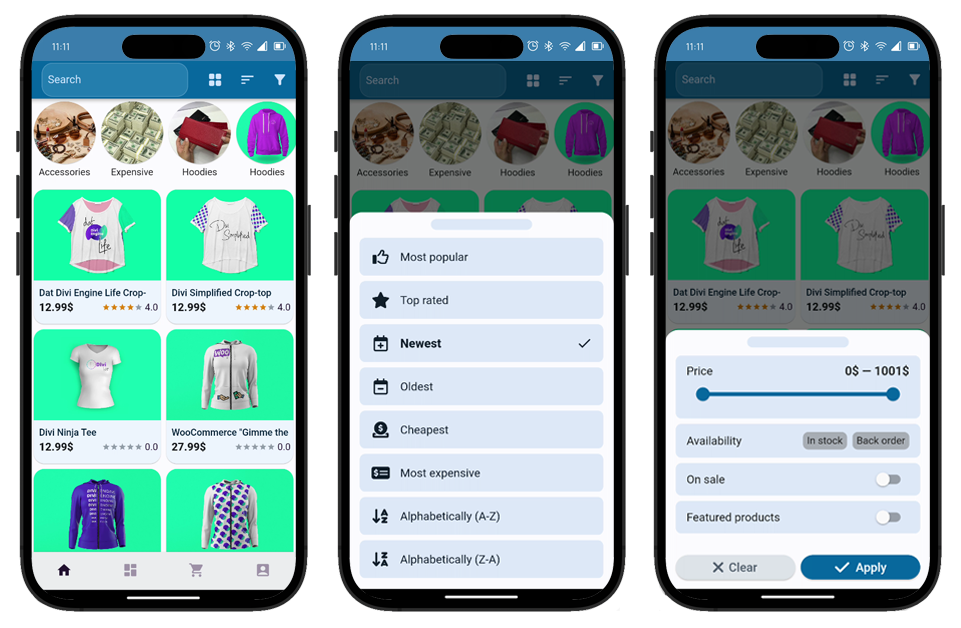
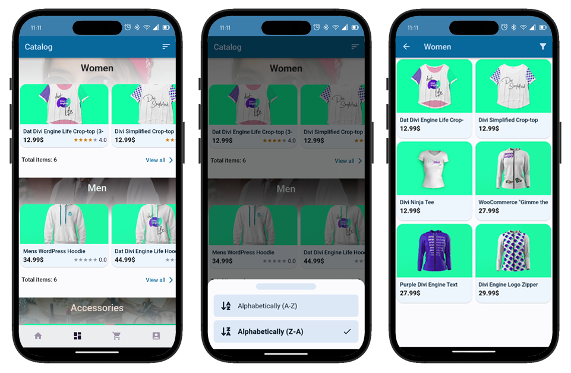
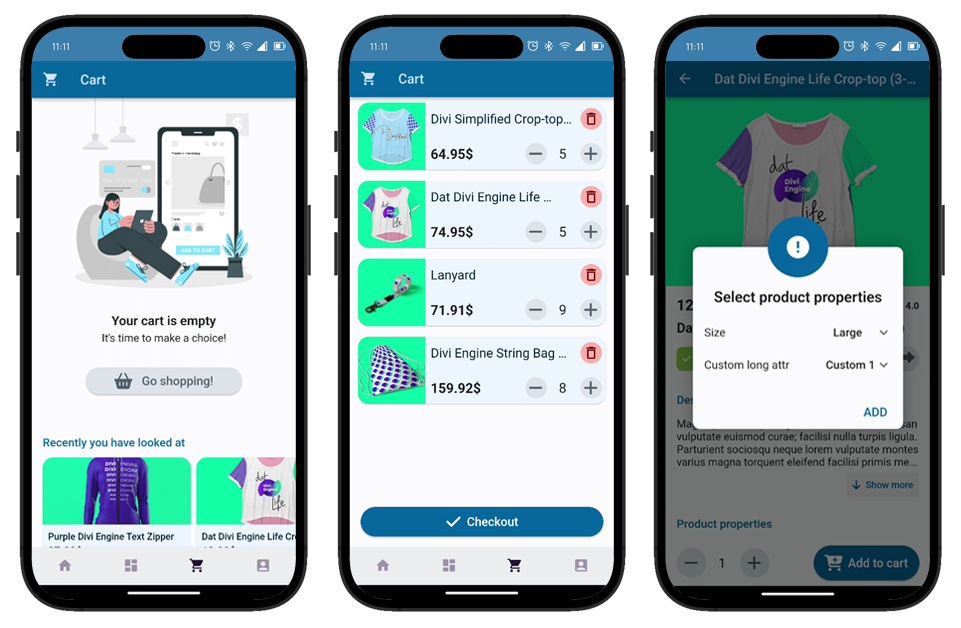
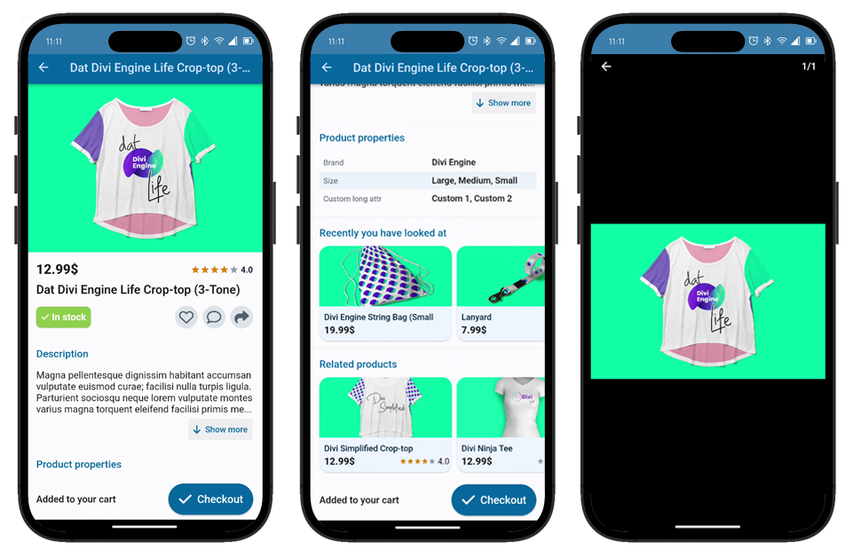

# WooCommerceMobile

[](https://github.com/ShiftHackZ/WooCommerceMobile/releases)

Flutter mobile WooCommerce application for your customers.

Convert your working WooComerce online store into full-featured mobile application, that allow customers to look for products, add them to cart, make orders, and more.

## Application functionality

### 1. Featured products 

Presents to the user all the products and categories that are listed in your WooCommerce website.

- Paginated lazy load of products (default page size is 10).
- Displays all available categories with corresponding image.
- Search by keywords query.
- Supports two different lists UI:
  - Grid list display
  - Feed list display (like Instagram) 
- Filtering products by:
  - Highest or lowest price
  - Featured or on sale
  - Available now or by back order
- Sorting products by:
  - Rating
  - Popularity
  - Date (ASC/DESC)
  - Price (ASC/DESC)
  - Alphabet (ASC/DESC)



### 2. Catalog 

Presents to the user all the categories with corresponding products for each category.

- Paginated lazy load of categories.
- Paginated lazy load of products for each of category.
- Dynamic UI coloring for category image and name (choosing color depending on image to match contrast).
- Sorting categories by alphabet (ASC/DESC).
- Viewing separate screen with paginated products list of particular category.
- Filtering products list of particular category by terms.



### 3. Cart

Allows to have a cart of some products, which allows to create and store a list of products that user is about to order.

Cart functionality works only for authorized users. If you try to interact with cart functionality on any screen, app will ask user to login or register.

- Displays the list of products that were added by user.
- If no products were added, displays the empty state, with button that routes user to **Fetured products screen**.
- For empty state displays the carousel with recently viewed products (if any).
- Deletion of product from the cart.
- Edit product quantity, and recalculate the product price.
- Routes user to **Order checkout screen**.
- Supports adding physical generic product.
- Supports adding physical variable product and will display variations that user needs to select.

Powered by [CoCart](https://docs.cocart.xyz/#introduction) plugin APIs.



### 4. Product

Presents all the information about particular product from the store.

- Contains information about the product:
  - Images
  - Name
  - Price
  - Rating
  - Availability status
  - Description
  - Properties / terms
- Supported CTA actions:
  - Open zoomable galley with all the product images.
  - Add / Remove from **Wish List**
  - Opening **Product Reviews**
  - Sharing product link
  - Open any of the Viewed / Category related product
  - Add to cart, or checkout if already added
- Carousel with recently viewed products
- Carousel with related category products



## Server requirements

- Working and fully functional [WordPress](https://wordpress.org/) website.
- Installed and enabled [WooCommerce](https://woocommerce.com/) plugin.
- Installed and enabled [WooApp](https://woo.moroz.cc) plugin.
- Installed and enabled [WP REST User](https://www.commoninja.com/discover/wordpress/plugin/wp-rest-user) plugin.
- Installed and enabled [CoCart](https://docs.cocart.xyz/#introduction) plugin.
- (Optional) Installed and enabled [TI Wishlist](https://wordpress.org/plugins/ti-woocommerce-wishlist/) plugin.

## Build instructions

In order to build the app, you need to create the `.env` file in project root directory, with the necessary variables.

Here is the example of `.env` file: 

```.env
# Base URL for the WooCommerce REST API 
WOO_BASE_URL = https://woocommerce.store/wp-json/wc/v3/

# Base URL for the CoCart REST API
CO_CART_BASE_URL = https://woocommerce.store/wp-json/cocart/v2/

# Base URL for the WordPress REST API 
WP_BASE_URL = https://woocommerce.store/wp-json/

# WooCommerce API Public token
AUTH_PUBLIC_TOKEN = (( SOME TOKEN STRING HERE ))

# WooCommerce API Secret token
AUTH_SECRET_TOKEN = (( SOME TOKEN STRING HERE ))

# CoCart API Public token
CO_CART_PUBLIC_TOKEN = (( SOME TOKEN STRING HERE ))

# CoCart API Secret token
CO_CART_SECRET_TOKEN = (( SOME TOKEN STRING HERE ))

```

For the security reasons do not commit or share with anyone content of this file. For this repo `.env` file is added to `.gitignore`. 

After that you can build the app using your local flutter environment (Android Studio, VS Code, or just execute `flutter build` / `flutter run` in console). 

## Available languages

User interface of the app is translated for languages listed below:

- English
- Українська
- Русский

Any contributions to the translations are welcome.

## License 

This license of the software is opensource, but contains some restrictions. 

- The software is provided as is and may contain some issues.
- Commercial usage of this app and any fork that is based on this app is not allowed without author permission.
- Distribution of this app and any fork that is based on this app to any public store (like Google Play, App Store, F-Droid) is not allowed without author permission.
- Every fork that is based on this app should contain original copyright UI section.

Full license agreement is available [here](https://1.cc).

## Maintainers

- Dmitriy Moroz / dmitriy@moroz.cc
